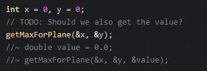

# Marked Comment Toggling

This package is meant to provide an alternative to the built-in comment toggling by marking the comments similar to Geany.  This minimizes interference with already present comments.  



## Supported Languages

This package uses the comment style of the current grammar of the editor (supplied in the ```language-``` packages).  Supported languages include C/C++/C#, Java, JavaScript, Python, CSS, HTML, among others.
